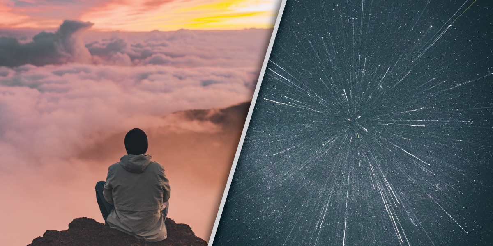

​

# Facing our fears so we can understand our differences, for the purpose of a shared reality

​  ​  ​ 

The universe will always be as large as it is, regardless of whether or not we can see the whole thing.

Our perceptions might as well be how we define reality. We can all observe one event, and regardless of how simple or straightforward that event is, we have seen time and time again that our perceptions will differ. This extends to our emotional state as well, with difficult events bringing insights that almost re-write the pain to be positive growth. Knowing that humans can’t seem to agree on a universal reality could be looked at as a terrifying thought, or depending entirely on how we choose to see things, it could be extremely intriguing. This choice holds a great deal of power because it means that the ability to see something differently is inside the self.

> Hate is not our belief system, or morals, or right vs wrong--it is fear of the unknown.

Humans really enjoy knowing things. The state of not knowing makes us so uncomfortable that we conjure and hypothesize or sometimes outright make up answers to satisfy the gap that information should fill. When we don’t know something, we don’t like to admit it, but more often than not we allow lack of knowledge to simply turn to fear. Fear most commonly expresses itself as hate, and it accounts for almost every prejudice we have toward each other. People that don’t understand differences hate differences. Hate is not our belief system, or morals, or right vs wrong--it is fear of the unknown. This is extremely difficult to accept and most humans flat out reject this simple and statistically overwhelming piece of psychology, even if it is out of their character to reject information.

If we do accept this, then we realize that hatred, and therefore prejudice, is a completely fixable problem. Fixable does not mean easy, and being humble enough to deprogram and then learn the necessary information takes guts. _Stepping outside the self, enough to really imagine a different set of circumstances that are nothing like your own experiences takes practice. It requires that we are always willing to learn._ It asks us to commit to leaving room for future information to alter what we feel should be our conclusion. This does not mean to live in a state of flip-flopping and to never own opinions or make conclusions. It means that we can never let ourselves stop learning.

> Change cannot be fought any more than time can be reversed. There is no point in trying to return to another time by wishing days past could be again.

The moment we believe we have learned enough is the moment we join the side of hate. Time is a cruel thing to those that hate change because it is the entity that ensures change is constant. Change cannot be fought any more than time can be reversed. There is no point in trying to return to another time by wishing days past could be again. What we can do is learn from our past and take our lessons into the future. Living in this state of acceptance naturally fights misunderstanding and hate and gives peace to the self. It is because of this that we should honestly celebrate our differences as they are opportunities to explore and understand more of the world. Instead of feeling small because we realized we knew less than we thought about the world, we can enjoy and marvel at how much more of the world there is that we get to experience.

One does not lose the self or a part of their identity when they change their mind. _We should be willing to explore outside the box ideas because of how much more interesting they would make the world if we could understand how they are possible._

​ ​

​ \[sidebar name="Left Sidebar"\] ​
