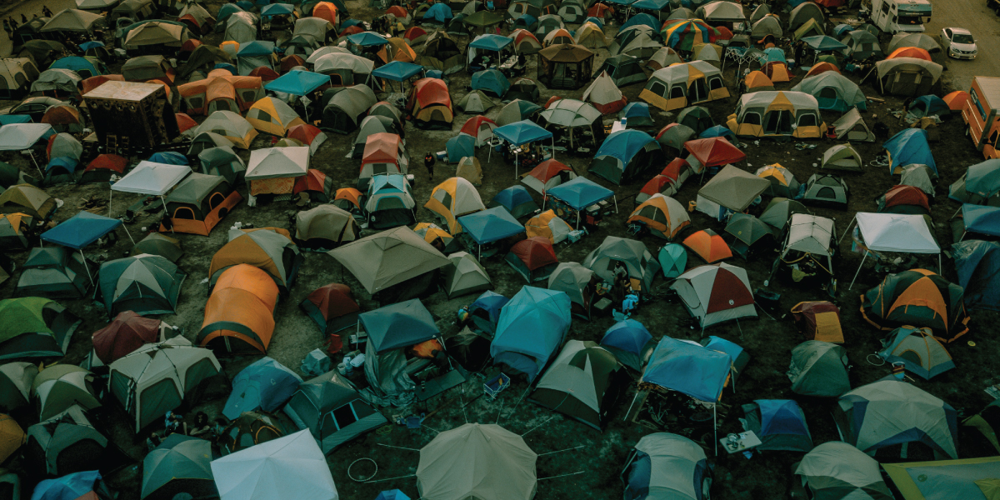

# Homelessness After College

​  ​ ​ 

_There are many uncomfortable conversations that are overdue in this country, but homelessness is a shame we share equally despite our politics, race, gender, sexuality, and religion._ The way we look at homelessness in this country, and the reasons that people use to justify a lack of action have become so accepted that we don’t even set goals to eradicate this very fixable problem, which goes against the grain for a country like the United States with money and ideals. We tell ourselves that the homeless are lazy, or crazy, or scum--and that fear is certainly valid and includes a percentage of the population--but the homeless are also largely good people that have fallen through the cracks and people that have been screwed by circumstance.

> the homeless are also largely good people that have fallen through the cracks and people that have been screwed by circumstance.

While it isn’t honorable that we pass by this problem in the streets on a daily basis, we should certainly take a moment to understand what societal influences are in place that allow us to ignore an injustice we are hardwired to feel empathy for. There seems to be a fear that drives inaction and silences our alarm for this innate empathy. It is an understandable fear that if we give a few dollars to the worn and tattered individual on a frequented corner of our travels that we might be enabling a drug habit or doing no good at all. On the other hand, we might be walking by someone we would feel empathy for if we only knew more details. It seems we want to help, but we have no idea how to help, and worse, we seem to have qualifications for who deserves the help. If we wish to solve the problem, we must see the problem clearly, and we cannot see clearly if we lump a spectrum of problems into one category.

There are many paths to homelessness, and the public should know that it is something we should all fear and empathize for because our system does not account for the hardships each citizen faces. Homelessness is an unacceptable consequence to our society’s failings but we should never allow ourselves to walk by those in need without realizing our own power in the situation. _It is the citizen that witnesses the hardship not the government, and it is our duty to speak and stand up for what we know first hand._

#### The Great Recession

The story of two motivated, educated, ideal employees that found themselves homeless, not because of their actions, their lack of actions, bad choices, or freak statistical anomalies, but because the shameful truth in this country is that not everyone always gets to have food, jobs, or homes.

Now, people think, "how nice that you have your own business and get to work for yourself", as though it was a dream or even a choice for us--back then, we didn’t stand a chance. It makes for an entertaining story so we laugh as we talk about our misfortune but to us the truth feels so ugly because it was not a story. We lived it. We aren’t haunted by trauma or terrified that we will find ourselves in the same position, but we are so heavily aware of how what happened to us still happens to people all the time--and we wonder, how can this go on?

> It should have been easy to find work but the next two years would be the most defeating and exhausting years of our lives.

We were bright-eyed and ready to conquer the world, my husband fresh out of a post-University internship in NYC, and both of us armed with some real experience in the marketing industry. We both had a hardy work ethic and several odd jobs on the resume. It should have been easy to find work but the next two years would be the most defeating and exhausting years of our lives.

My husband has Crohn’s disease and at the time this meant that he was uninsurable. We were able to eventually get him minimally covered by a high risk pool, which did little to comfort us because we were still paying around $1000 a month without ever even seeing a doctor. This extra cost buried us at a time in your life that should be about growth and building for the future. Our finances made so many decisions for us where others would be weighing choices. My return to University was delayed, starting a family was hopelessly off the table, and it was hard to think of a time that might allow us those choices again. We lived resourcefully, on less than the coffee budget of most people, and took every opportunity for work we were ever offered. We spent hours every single day looking for work, never limiting the search. We did anything. Our most reliable gig was an under the table job in a guy’s garage where we poured automotive paint from large containers into smaller containers and labeled them. This had nothing to do with any skill set we had acquired, but personal growth and opportunities were not things we were allowed.

> Our finances made so many decisions for us where others would be weighing choices.

We had applied for and been yanked around on hundreds of jobs and even had our work stolen in interviews, but it wasn’t until a nuclear meltdown of a rejection that we knew we weren’t going to make it. That “Ah ha” moment was after both of us were turned down to do one pizza delivery job collectively, for one minimum wage salary that we offered to split. _It is hard to describe the humiliation that comes with being unable to replicate the life that your parents had when you are following the principles that they instilled in you to get there._

So many of our decisions were made from desperation, despite our belief that good decisions are never made this way. We knew that the job market offered us nothing, so it didn’t really matter how much we weren’t interested in being our own bosses--we were going to need to create our own jobs or we weren’t going to have jobs. We didn’t really think of this as starting a business as much as marketing our skill sets as freelancers. Looking back, it was the birth of an idea that we grew into a justice seeking machine for the people like us that have been left behind.

All waking hours were consumed by searching for work, learning about how to run a business, creating examples to show our abilities, and doing whatever odd or end we could get hired for to pay what we could of the bills in the meantime. We were exhausted, depressed, gaining weight, and falling way behind in every way you could. We saw that the ship was sinking, and even though we both thought of ourselves as fiercely independent adults, we asked to move in with my parents to try to get back on our feet.

This temporary time doubled when we couldn’t find affordable housing and with every move we felt like we were falling off the ladder instead of climbing it. Our desperation pushed us into a series of bad living situations. We lived in a converted stallion stall and worked weekends to pay our way on a farm, we lived in a camper, we lived in a car, and at a real low point, we lived in a tent down by a river until a notable storm flooded out our camp.

> There becomes a point where you can’t escape the feeling and thought, “Is this how it is supposed to be?”

Not having a home is a singular experience. You look around at the way others live and wonder what they would think if they just knew how happy you would be to live in their shed. There becomes a point where you can’t escape the feeling and thought, “Is this how it is supposed to be?”.

It isn’t. This is not how any human regardless of differences would punish their fellow citizen and more than anything it hurt me to think how my family, my friends, and my neighbors likely wouldn’t have voted for the things they did if they just understood the factors that led to our struggle.

_We must consider the factors that lead us to our votes and check to ensure that they are not cruel when systems fail. We must listen to those in pain and intake their problems with empathy to ensure that we aren’t blind to our family, friends, and neighbors when they are trusting us with the stories of their hardship, and we must make sure above all, that when we vote, we realize that we can accomplish more together when we collectively vote for everyone, than when we all just vote for the self._

What can I do as a citizen?

Up by the Bootstraps, is a four step program, a community and support group, resource center, training hub, and employment entry program that requires no government assistance, capital, or public monetary donation to operate. The approach is a fundamental shift in defining solutions to immediate issues the homeless community faces and is designed to be replicable without the need for any structure to be created in new areas.

\[popup\_anything id="1347"\]

​

Next Segment In This Series: [Homelessness After College 2](https://www.fightwithyourmind.org/homelessness-after-college-2/)

\[sidebar name="Right Sidebar"\] ​ ​
