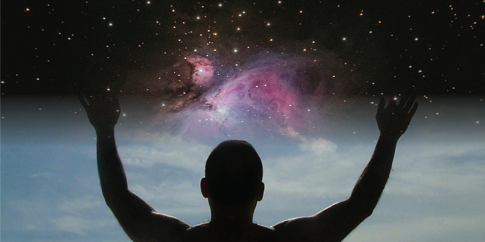

​

# It is more important that we question than which questions we ask

​  ​  ​ 

We use science to explore the world around us, to solve problems, to generally improve or ease difficult tasks, and to heal sickness or extend life. To those that are religious, science may hold little meaning for existential questions, but to non-believers, science can fill that same need for existential discovery because it is the path to understanding what it is that we exist in. It is personal to each of us whether the primary or centric question should be why--more answered by religion, or what--more answered by science. Most of the time we see this as two different or even opposing sides but it is important for us all to understand that this questioning is the root of a similarity we all share. _As humans we all yearn to understand ourselves and our world_\--though we often focus on the differences in the details of what religion or science we do or don’t believe in.

> To those that are religious, science may hold little meaning for existential questions, but to non-believers, science can fill that same need for existential discovery because it is the path to understanding what it is that we exist in.

Whether we are exploring our existence through the lens of religion or science, we still share common questions. Why are we here, and how did we get here? What does it all mean?

_As humans, we are all wired to wonder whether or not there is any importance to our existence_, and we wonder what mechanism brought us to be. Religion offers answers to these questions where science does not and it seems that we should ask ourselves if this is what is alluring about religion if the alternative is to live and die likely never understanding our purpose with science.

Religion offers less for some of the more Earth-based questions which can often be answered through science without disagreement between believers and non-believers. Science has had an impact on our understanding of the forces we encounter on Earth, the materials that our surroundings are made of, and the general layout of our visible universe. It has given us answers and demystified our surroundings, however about 100 years ago progress in science began to create questions just as much as it provided answers. Suddenly, scientists began discovering that the laws governing the universe were in fact not universal across the scales of size.

> Suddenly, scientists began discovering that the laws governing the universe were in fact not universal across the scales of size.

To make sense of this, science began to search for a unified theory, to unite the laws of the very small with the laws of the vast and endless. Where religion views this as proof that science is reverse engineering explanations, scientists view this as a step toward a more enlightened state of understanding. Science would say that religion has no root in reality, and religion would say that scientists lack faith. _Despite this perpetual disagreement, there are commonalities in the disagreement itself--both groups have elements that appear to the other to be unbelievable or unverifyable, and both see the other’s beliefs as a justification for an unacceptable worldview._ However, in looking at it, the largest difference, it seems, is not whether or not you have faith but where you put your faith--either the truth is already determined, written for us to follow, or the truth is here for us to discover, if we are open enough to see it. But what if it is both, or neither, or like most things, a combination?

We have two groups, religious and non-religious, both on a search for god or knowledge through two fundamentally different systems of understanding. In our society, we are wired to feel like we have to choose between different options, however when we reject this, we can take advantage of a larger range of information, perspectives, and views on reality. If we could just drop the details momentarily for the purpose of exploration, our similarities would be highlighted instead of our differences.

Both believers and non-believers aren’t seeming to realize that they are having a shared experience. Our shared uncertainty of the other puts us all in the same boat more than we realize because both groups have an extraordinary faith that the path they are on will lead to an ultimate truth for themselves as well as a truth that proves other views wrong.

> our need to feel like we are right creates the true division in our shared realities

When we feel threatened we tend to polarize, circle the wagons, and start formulating arguments against our perceived opponents. The walls we build make our separation possible, but our need to feel like we are right creates the true division in our shared realities. As humans that live in a three dimensional space that travels through the one way valve that is progressing time, change is absolutely inevitable. Hating change is common, but possibly we should stop thinking of it as normal because hating change seems to directly result in hating others. When we believe we are right, we stop taking in information, and when we stop taking in information we freeze in time, rejecting what is in front of our eyes with disbelief.

Whether we are believers or non-believers, it is important that we don’t block our paths to new information, and that we follow that information, not where we want it to go but where it does. _We have all made an assumption that we can only answer these existential questions by choosing a system of thought. True progress can only be made when we put ourselves in the uncomfortable position of accepting the fear that is attached to what we don’t know._ When the fear of the unknown drives so many to a system of belief to deal with existential questions, it is important to take a second look at why we hold on to the systems that we know divide us. We should question our beliefs and our systems because they are just as much a source for hate as they are a source for personal comfort. Maybe we can come together eventually, but in the meantime, we should remember that whether we compare ourselves to a god, or to a vast universe, we should all be humble in its mighty presence.

​ ​

\[sidebar name="Right Sidebar"\] ​ ​
