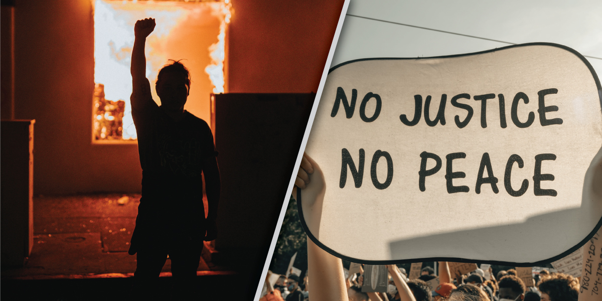

# When peaceful protesting is ignored by power, violence is inevitable

Rebellious Teenagers are a sign of ignorant parents. Many of us remember this first-hand, acting out as teenagers with self-destructive behaviors that hurt no one but ourselves. As much as it seems counterintuitive, to a teenager, it is a cry for attention, help, or some kind of change. There are usually signs of struggle that proceed acts of rebellion that go unnoticed, which is usually the reason for the act of rebellion in the first place. As parents, it is normal to let life get in the way of the things we should be seeing in our children, however, usually, when these rebellious events occur, we wake up and realize that we need to pay attention more than we have been.

_Our government is designed to take on a parental role,_ and listening to the needs, wishes, and hardships that constituents face is part of the job description. This seems especially lost these days, and at a time of ubiquitous protesting in our country, listening is more important than ever before. The rioting and escalation to violence in response to yet another black man murdered by a police officer should not be considered a misbehavior of the public. This misinterpretation of the public’s actions and responses only reveals the extent of the ignorance of power.

Psychologically, this is no different than the rebellious teenager. The people have tried calm communication. They have been non-violent. The only result was the realization that power doesn’t listen to non-violent communication. _Instead of focusing on the public’s escalation in the streets, we should ask the government why they didn’t listen_ when the public used peaceful channels–why they didn’t listen, even though it was their job to do so. Like anyone that finds themself desperate and out of positive options, the people, much like an angry teenager, started to take on destructive behaviors. The simple psychology of this situation is so straight forward that I find myself baffled that those in power do not recognize it.

> I do not condone violence but I also see uprising that becomes violent for what it is--a thermometer.

I do not condone violence but I also see uprising that becomes violent for what it is--a thermometer. Violence, not surprisingly, is a red hot indication that there is a massive disconnect between power and people. Violence does not occur randomly or without cause. When peaceful protest turns violent it is almost always because those that should be listening are not.

Violence is an act of desperation to be heard and an act of desperation for change. Instead of condoning violence from their soap box, the government should take some accountability and admit to themselves and the public that violent events would have been unlikely to transpire if those in power had listened in the first place.

After shirking the duties of their offices, being ignorant to the realities and experiences of their constituents, and ignoring the peaceful cries for help, the fact that politicians have the audacity to ask the people to stop pursuing the only option that they have left is screwed up. Yet the same people that are getting screwed would likely be worse off if they said out loud the thing that no one wants to admit. Violence gets their attention.

_Historically, violence is one of the most reliable catalysts for change. Reviewing the history books, there are very few peaceful communications that resulted in meaningful reactions from the associated powers. Unfortunately, most change only occurs because things finally got violent._

> I am of the school of thought that believes that resorting to violence shows a lack of creativity

I am of the school of thought that believes that resorting to violence shows a lack of creativity, and personally I don’t even think it should be used as a last resort. Quite frankly, if you feel that someone needs to be hurt to get what you want, then maybe it is time to consider that what you want isn’t worth it. However in situations where authority abuses its power, there does seem to be a need for something to help level the playing field.

"Stop the violence"–even though I agree, those words are insulting coming out of the mouths of those that ignored the needs of their people. It is hypocritical at best. Just once I want to hear a politician address the neglect of their people before they bring up that very meaningful phrase. Stop the violence. _It is your responsibility, YOU–the person in power, to stop this madness every bit as much as the person committing the violent acts._ Don’t act like stopping this all is any more complicated than YOU just finally listening.

\[sidebar name="Left Sidebar"\]
